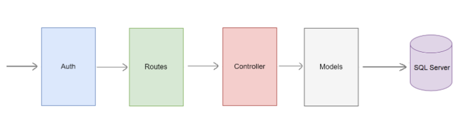

# Bird Accommodation System - API

## Intruction

You will need to install database in case you do not have it. You can use the `Bird_AC2.sql` file in the `database` folder to create the database.
- Open the file in SQL Server Management Studio and run it
- Then you can use the `Bird_AC2_Data.sql` file to insert data into the database

Before starting the server, you will need to create a `.env` file in the current directory, following the format in `.env.example` file.

Finally, to start the server open cmd and run:
```bash
npm run backend
```

## Detail about source code
In the server, we use the middleware architecture as following:
- The request will have to pass through the `mdw.js` middleware to check for the authorization layer (if required)
- Then it will be routed by `routes.js`
- The logical business flows are implemented in the `controller.js` layer
- Controller will then call the `models.js` layer to query the database

<p align="center">
  
</p>

