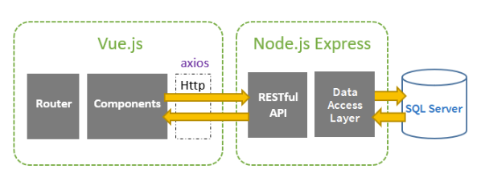
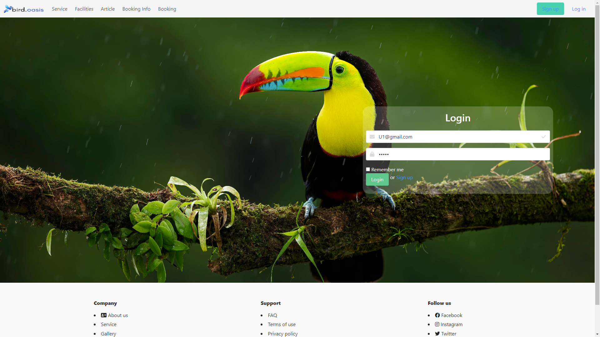
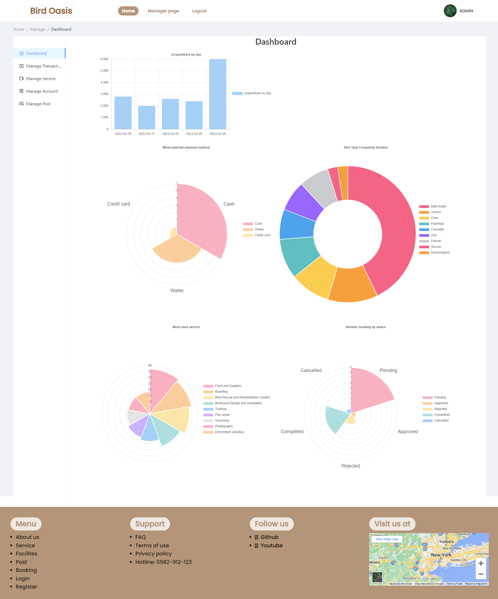
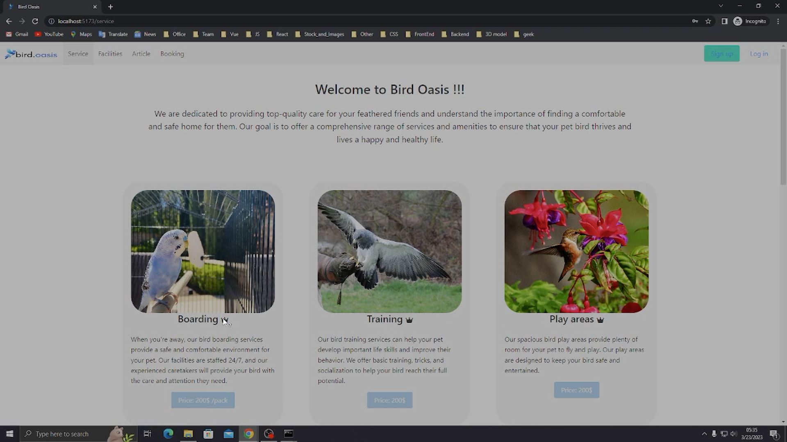

# Bird Accommodation System

## Table of Contents
<details>
  <summary>Click to expand</summary>

  - [Introduction](#introduction)
  - [Tech Stack](#tech-stack)
  - [Features](#features)
  - [Installation and Usage](#installation-and-usage)
  - [Gallary](#gallery)
  - [Demo](#demo)
  - [Contributions](#contributions)
  - [License](#license)

</details>

## Introduction
Bird Accommodation System is an online platform designed to help bird owners and enthusiasts find suitable accommodation for their birds. Our project follow the 3-tier architecture model and use the following technologies:

- VueJS to build up the front-end
- ExpressJS to create RESTful API
- MS SQL database to store data
<div align="center">
    
</div>

## Tech Stack
<!-- Front-end -->
<div align="center">
  <a href="https://vuejs.org" target="blank" rel="noreferrer"></a> 
  <a href="https://ant.design" target="blank" rel="noreferrer"></a>
  <a href="https://www.chartjs.org" target="blank" rel="noreferrer"></a>
  <a href="https://bulma.io" target="blank" rel="noreferrer"></a>
  <a href="https://vitejs.dev" target="blank" rel="noreferrer"></a>
</div>
<!-- Back-end -->
<div align="center">
  <a href="https://nodejs.org" target="blank" rel="noreferrer"></a>
  <a href="https://expressjs.com" target="blank" rel="noreferrer"></a>
  <a href="https://jwt.io" target="blank" rel="noreferrer"></a>
  <a href="https://www.npmjs.com" target="blank" rel="noreferrer"></a>
</div>
<!-- Database -->
<div align="center">
  <a href="https://www.microsoft.com/en-us/sql-server" target="blank" rel="noreferrer"></a> 
</div>

## Features
The website provides basic features such as:
- Register account
- Login account
- Booking system
- Review and rating system
- Billing and Payment
- Admin dashboard

## Installation and Usage
To run this project, you first need to install [Node.js](https://nodejs.org) and [Git](https://git-scm.com/downloads) on your computer. Then, follow these steps:
1. After cloning this repository, navigate to the project directory
```bash
cd SWP391_FPT_miniproject/Bird_Accomodation_Vue_ExpressJs
```
2. Install dependencies and wait for the installation to finish
```bash
install.bat
```
3. Run the project
```bash
run.bat
```
4. Open your browser and go to `http://localhost:5173`

## Gallery
<div align="center">
    
    <p>Home page</p>
</div>
<div align="center">
    
    <p>Login page</p>
</div>
<div align="center">
    
    <p>Admin dashboard</p>
</div>

## Demo
<div align="center">
  <a href="#"></a>
</div>

## Contributions
- [tien-rayujin](https://github.com/tien-rayujin)
- [tnt-exe](https://github.com/tnt-exe)
- [maotou-spy](https://github.com/maotou-spy)
- [slowbut-sure](https://github.com/slowbut-sure)
- [thanhplassma](https://github.com/thanhplassma)

## License
[](./LICENSE)